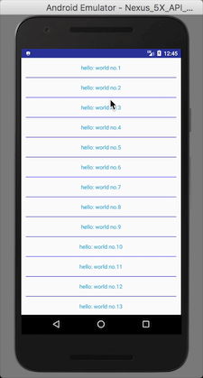

## AndroidUiKit
**安卓常用UI组件库。**
总结、沉淀、封装优化；为避免重复造轮子，此项目会收集优秀的三方库，或直接引用，或修改源码；目标很明确：**快速集成开发，提高效率。**


#### ISwipeRefreshLayout
 参考官方SwipeRefreshLayout源码实现，用法一致。支持自定义RefreshView。

#### 经典下拉刷新效果
推荐一个[动画库](https://github.com/81813780/AVLoadingIndicatorView),效果很棒，代码简洁，本文ISwipeRefreshLayout组件可直接使用。代码在手，想怎么搞都行。
   

##### 参考资料
- [IRecyclerView](https://github.com/Aspsine/IRecyclerView)
- http://blog.csdn.net/lmj623565791/article/details/24252901
- http://blog.csdn.net/guolin_blog/article/details/17357967


#### IDividerItemDecoration

```
/**
 * features:
 * 1. 支持divider height 、color 、padding 等熟悉设置
 * 2. 自定义Divider Drawable
 * 3. divider绘制位置。call method {@link #setOffsetMode(int)}
 */

 IDividerItemDecoration divierDecoration = new IDividerItemDecoration(this,IDividerItemDecoration.VERTICAL)
                .setVerticalDividerHeight(50)
                .setDividerColor(Color.BLUE)
                .setOffsetMode(IDividerItemDecoration.OFFSET_MODE_TOP)
                .setDividerPadding(30);

   // or setCustomDrawable
   // divierDecoration.setDrawable(getResources().getDrawable(R.drawable.custom_divider))
   recyclerView.addItemDecoration(divierDecoration);

```

#### TabLayout

**推荐两个库：**

- [FlycoTabLayout](https://github.com/H07000223/FlycoTabLayout)

- [MagicIndicator](https://github.com/hackware1993/MagicIndicator)

本项目在**FlycoTabLayout**基础上进行修改和裁剪而来。


#### MultiType(复杂列表视图新写法）

在[MultiType](https://github.com/drakeet/MultiType)库的基础上，实现的支持上拉加载更多的[MultiTypeLoadMoreAdapter](https://github.com/yangjiantao/AndroidUiKit/blob/master/uikit/src/main/java/io/jiantao/android/uikit/adapter/MultiTypeLoadMoreAdapter.java),
支持各种layoutmanager布局，加载效果简单，这里就不贴出来了。

另外，MultiType是一个很棒的库，设计优秀，代码简单，完爆各类对Adapter的封装库，值得查阅源码。

  

#### FrameAnimDrawable
一个解决安卓帧动画OOM的组件。[文章详情](http://www.jianshu.com/p/3a8861678a45)

#### Multi-media selector
图片选择，相信大多数app都有这个功能，这里推荐两个优秀的开源库。
- [知乎-Matisse](https://github.com/zhihu/Matisse)

     
  
- [Bilibili-boxing](https://github.com/Bilibili/boxing)

   

这两个都不错，经过考察结合实际情况，我推荐使用Matisse。

#### 大图浏览(支持超大图)
基于[SubsamplingScaleImageView](https://github.com/davemorrissey/subsampling-scale-image-view)开源库实现，增加单手拖拽等效果。

   


#### [FocusLayoutManager](https://github.com/CCY0122/FocusLayoutManager)

> 有焦点item的水平/垂直滚动RecyclerView-LayoutManager。仿Android豆瓣书影音“推荐“频道列表布局。


#### [ViewPagerLayoutManger](https://github.com/leochuan/ViewPagerLayoutManager)


#### BottomDialog 底部弹框

- [BottomDialog 1.2k star](https://github.com/shaohui10086/BottomDialog)

  

- [IBottomSheetDialogFragment](https://github.com/yangjiantao/AndroidUiKit/blob/master/uikit/src/main/java/io/jiantao/android/uikit/dialog/IBottomSheetDialogFragment.java) 继承至官方组件BottomSheetDialog改造，支持恢复数据。

### 参考与推荐

- [awesome-github-android-ui](https://github.com/opendigg/awesome-github-android-ui) 

##### Thanks 感谢所有开源项目作者。
